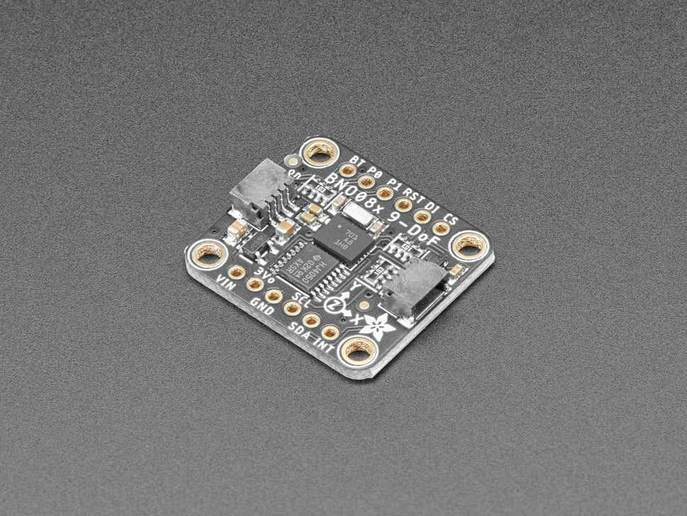
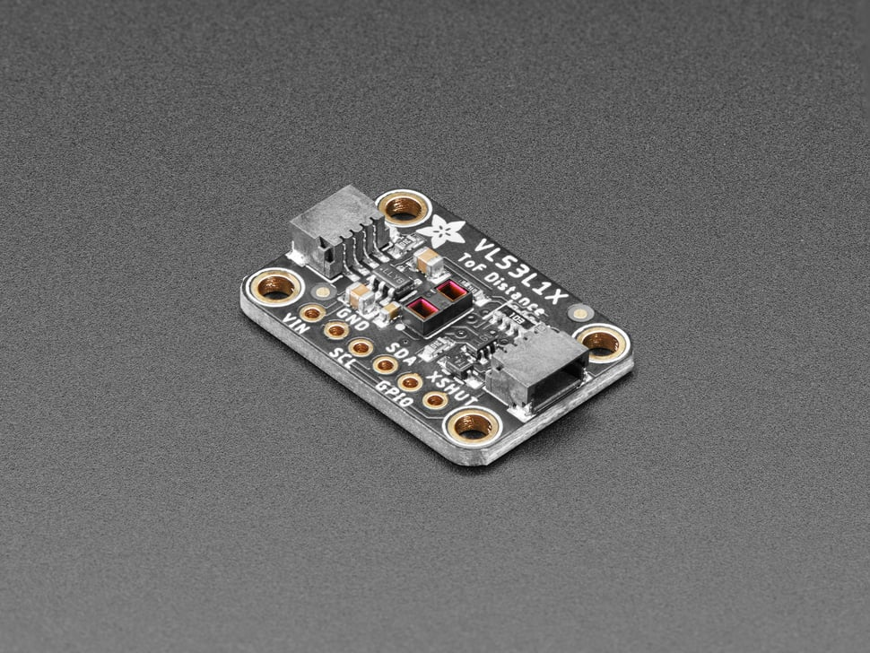

# Project Overview
A ROS2 Package hosting a Kalman Filter from scratch to combine data from a 9-DoF IMU and a time-of-flight distance sensor 
attached to the end-effector of a delta robot. The filter will be used to estimate the position and velocity of the 
end-effector in 3D space.Results will be visualized with a 3D plot, written in C++ and compared to kinematics estimations from the robot's control system.

Learning Concepts:
- Kalman Filtering
- Reading I2C data from high-speed sensors
- Eigen Library (C++ Library for Linear Algebra and Matrices)
- Graphics and Plotting in C++

# Sensor Details

## BNO085 IMU

  

The [BNO085 IMU](https://www.adafruit.com/product/4754) has the following features:

- **Acceleration Vector / Accelerometer**
    - Three axes of acceleration (gravity + linear motion) in m/s^2
- **Angular Velocity Vector / Gyro**
    - Three axes of 'rotation speed' in rad/s
- **Magnetic Field Strength Vector / Magnetometer**
    - Three axes of magnetic field sensing in micro Tesla (uT)
- **Linear Acceleration Vector**
    - Three axes of linear acceleration data (acceleration minus gravity) in m/s^2
- **Gravity Vector**
    - Three axes of gravitational acceleration (minus any movement) in m/s^2
- **Absolute Orientation/  Rotation Vector**
    - Four point quaternion output for accurate data manipulation

Thanks to the sensor fusion and signal processing wizards from CEVA, with the BNO085 you also get:

- **Application Optimized Rotation Vectors**
      - For AR/VR, low latency, and low power consumption
- **Additional Base Sensor Reports**
    - Separate and simultaneous outputs of Calibrated, Uncalibrated + Correction, and Raw ADC outputs for the Accelerometer, Gyro, and Magnetometer
- **Detection and Classification reports:**
    - Stability Detection and Classification
    - Significant Motion Detector
    - Tap, Step, and Shake Detectors
    - Activity Classification

## VL53L1X Time of Flight Distance Sensor

  

The [VL53L1X ToF Sensor](https://www.adafruit.com/product/3967) is capable of precise distance measurement within a range of $[30, 4000]$ mm, with up to a 50Hz update rate and a $27^\circ$ field of view which can be configured with a programmable Region of Interest (ROI).

## Resources
- https://www.cs.unc.edu/~welch/media/pdf/kalman_intro.pdf
- https://groups.seas.harvard.edu/courses/cs281/papers/unscented.pdf
- https://www.kalmanfilter.net/default.aspx
